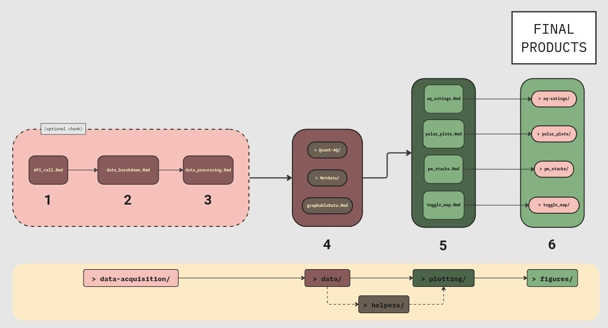

# ambient-summer23

This repository focuses on working with 18 Roxbury Modulair and Mod-PM
sensors that are deployed as of Summer 2023. The code here covers
data acquisition, data pre-processing, plotting, and some other
functionality that is needed for a comprehensive analysis of ambient
data in Roxbury for our goals of identifying the primary sources of
ambient air pollutants in Nubian Square, and quantifying their
proportional contribution to overall exposure.

### Dependencies

As of 08/01/23, this repository is written entirely using R version
4.3.1. The R version output is as follows:

`R version 4.3.1 (2023-06-16) -- "Beagle Scouts"`

`Copyright (C) 2023 The R Foundation for Statistical Computing`

`Platform: x86_64-pc-linux-gnu (64-bit)`

As another side note, as of 08/01/23, this repository is written and run
solely on Ubuntu 22.04.2 LTS. If you are running this code on Ubuntu and
are running into trouble with downloading libraries, make sure to
download the prereqs to those libraries using [Posit Package
Manager](https://packagemanager.posit.co/client/#/repos/2/packages/A3)
as a reference.

### Using the repository

1.  Clone the repository.

    -   Using SSH
        `git clone git@github.com:airpartners/ambient-summer23.git`
        (Recommended, you will need an SSH key for this, follow [this instruction](https://docs.github.com/en/authentication/connecting-to-github-with-ssh/generating-a-new-ssh-key-and-adding-it-to-the-ssh-agent))
    -   Using HTML:
        `git clone https://github.com/airpartners/ambient-summer23.git`

2.  Navigate to the local repository using your terminal. ex:
    `cd ambient-summer23` If this project is correctly compiled, the following files should be present:

    -   data-acquisition/ (folder that deals with data acquisition from sensors and performs preliminary cleaning on the data):
        -   API_call.Rmd
        -   data_breakdown.Rmd
        -   data_processing.Rmd
        -   helpers/:
            -  API_call_helpers.R
            -  data_breakdown_helpers.R
    -   plotting/ (folder that performs data analysis through plotting):
        -   aq_ratings.Rmd
        -   pm_stacks.Rmd
        -   polar_plots.Rmd
        -   toggle_map.Rmd
        -   helpers/:
            - exporting_html.R
    -   helpers/ (folder that contains an extra step outside of the basic data acquisition/plotting functions):
        -   filtering.Rmd
        -   workflowDiagram.jpg

3.  Below is a workflow diagram of this repository.

    - For a more comprehensive guide (with guiding questions), visit this [Miro board](https://miro.com/app/board/uXjVMxiXxIU=/?moveToWidget=3458764560658402046&cot=14).
